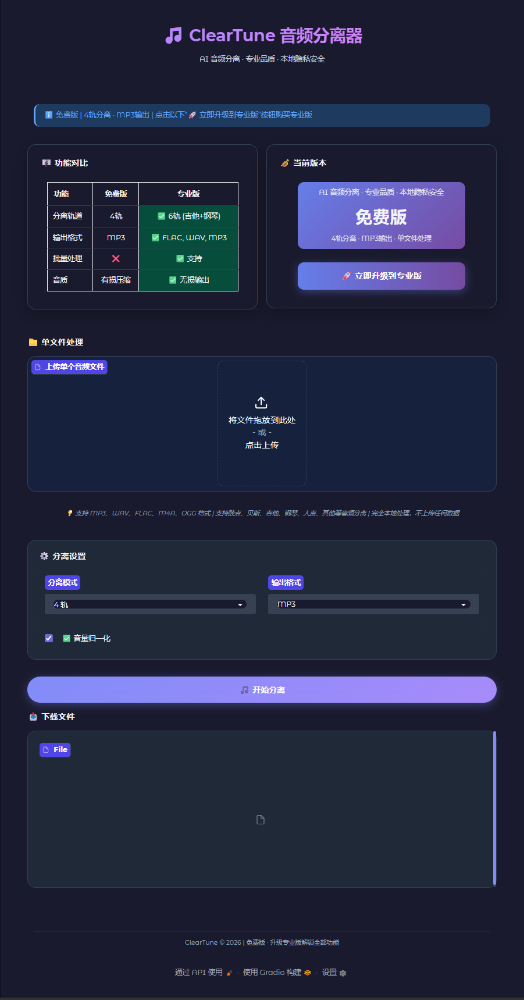

# 🎵 TuneWiz 音乐分离器

## 重新定义音频分离 —— 专业、免费、本地化

  
  
  
  

---

## 🚀 30秒看懂 TuneWiz

**TuneWiz 是一款革命性的 AI 音频分离工具。**

**该软件为绿色版本，无须安装，点击即可运行。**

上传任何歌曲，一键提取人声、鼓点、贝斯、吉他、钢琴——**完全免费，完全本地运行，绝不上传你的任何数据。**

无论你是音乐制作人、视频创作者、播客主播，还是只想消掉原唱自己唱首歌的普通人，TuneWiz 都能在几秒到几分钟内给你专业级的结果。

---

## ✨ 让人惊艳的功能

### 🎯 核心分离能力

| 功能 | 免费版 | 专业版 |
| :--- | :--- | :--- |
| **分离轨道** | 4轨（人声、鼓、贝斯、其他） | **6轨**（+ 吉他、钢琴） |
| **输出格式** | MP3 | **FLAC / WAV / MP3** |
| **音质** | 优秀 | **专业级无损** |
| **批量处理** | 单文件 | **无限批量** |
| **GPU加速** | 支持 | **满血加速** |

### 🔥 独家亮点

- **🎤 人声提取**：干净到几乎没有背景音，翻唱神器
- **🥁 鼓点分离**：提取纯鼓轨，适合 remix 和节奏分析
- **🎸 贝斯提取**：低频精准，适合扒谱和混音
- **🎹 吉他/钢琴分离**：6轨模式下独立提取，编曲神器
- **📀 伴奏提取**：一键消人声，获得纯净伴奏

---

<!-- ## 🎨 界面截图
 -->

### 设计理念

- **极简主义**：一个主卡片，无冗余装饰
- **专业配色**：Google Material 风格，干净利落
- **即时反馈**：实时进度条，分离成功立即显示
- **一键试听**：分离后直接在线播放，无需下载

---

## 🎯 谁在用 TuneWiz？

### 🎵 音乐制作人
> “以前分离一首歌要折腾半小时，现在拖进去等两分钟就拿到6个干净音轨。贝斯和鼓点分离得特别准，拿来采样太爽了。”

### 🎬 视频创作者
> “做视频需要背景音乐去人声，TuneWiz 一键搞定，而且完全本地运行，不用担心版权和隐私问题。”

### 🎤 翻唱歌手
> “找伴奏找不到？自己提取！人声提取干净到可以直接混音，效果比某些付费网站还好。”

### 📚 音乐教育者
> “上课需要给学生听单独的贝斯线、鼓点，TuneWiz 帮我省了无数时间。”

### 🎮 游戏音频设计师
> “从游戏原声里提取音效素材，质量出乎意料的好。”

---

## ⚡ 性能数据（真实测试）

| 音频长度 | 设备 | 处理时间 |
| :--- | :--- | :--- |
| 3分钟歌曲 | CPU (i7) | ~45秒 |
| 3分钟歌曲 | GPU (RTX 3060) | **~12秒** |
| 5分钟歌曲 | CPU (i7) | ~75秒 |
| 5分钟歌曲 | GPU (RTX 3060) | **~20秒** |

### 技术架构

- **AI 模型**：Demucs Hybrid Transformer V4（行业领先）
- **分离质量**：SDR 最高可达 **9.20 dB**（专业级）
- **音频格式**：支持 MP3、WAV、FLAC、M4A、OGG
- **采样率**：44.1kHz / 48kHz 可选
- **位深度**：16bit / 24bit / 32bit float

---

## 🔒 隐私安全 —— 最大优势

**TuneWiz 完全在本地运行，不上传任何数据。**

- ❌ 不上传你的音频文件
- ❌ 不留存任何录音
- ❌ 不需要联网
- ❌ 不收集使用数据

**对比在线服务：**
| 服务 | 数据上传 | 隐私风险 | 免费额度 |
| :--- | :--- | :--- | :--- |
| TuneWiz | ❌ 不上传 | ✅ 完全安全 | 无限制 |
| 某在线网站 | ✅ 上传服务器 | ⚠️ 隐私未知 | 有限 |
| 某付费软件 | ✅ 需联网验证 | ⚠️ 需信任厂商 | 按次/月付费 |

---

## 💰 定价 —— 良心到令人感动

### 免费版（永久免费）
- ✅ 4轨分离（人声、鼓、贝斯、其他）
- ✅ MP3 输出
- ✅ GPU 加速
- ✅ 本地处理，隐私安全
- ✅ 无限制使用

### 专业版（一杯咖啡钱）
- ✅ **6轨分离**（+ 吉他、钢琴）
- ✅ **FLAC / WAV 无损输出**
- ✅ **无限批量处理**
- ✅ **优先技术支持**

> 对比市场：某同类软件 ¥16.8/月 只有基础功能且转换速度极慢，TuneWiz 免费版速度快，专业版同等价格多送吉他/钢琴轨 + 无损输出。

---

## 🚀 快速开始

### 1. 下载

- 网盘链接：[点击下载](https://pan.baidu.com/s/1plfBTtUPmOitP44trftyCw?pwd=bekp)

### 2. 使用
1. 拖入音频文件
2. 选择分离模式（6轨/4轨）
3. 点击「开始分离」
4. 等待完成，在线试听或下载

### 3. 激活专业版
将 `license.key` 文件放入程序目录，重启即可。

---

## 📊 对比竞品

| 功能 | TuneWiz | NovaMSS | LALAL.AI | Spleeter |
| :--- | :--- | :--- | :--- | :--- |
| **免费额度** | 无限制 | 有限 | 有限 | 无限制 |
| **6轨分离** | ✅ 专业版 | ✅ 专业版 | ✅ 付费 | ❌ |
| **本地处理** | ✅ | ❌ 云端 | ❌ 云端 | ✅ |
| **隐私保护** | ⭐⭐⭐⭐⭐ | ⭐⭐ | ⭐⭐ | ⭐⭐⭐⭐⭐ |
| **FLAC输出** | ✅ 专业版 | ✅ 专业版 | ✅ 付费 | ✅ |
| **GPU加速** | ✅ | ✅ | ✅ | ✅ |
| **界面美观度** | ⭐⭐⭐⭐⭐ | ⭐⭐⭐⭐ | ⭐⭐⭐⭐ | ⭐⭐ |

---

## 🗣️ 用户真实评价

> *"我试过市面上几乎所有音频分离工具，TuneWiz 的人声干净度排第一梯队，而且还是免费的。强烈推荐！"*
> —— **李同学，音乐制作人**

> *"之前用某在线网站分离一首歌要等5分钟还收费，TuneWiz 用我自己的 GPU 12秒就搞定，省时省钱。"*
> —— **王老师，视频创作者**

> *"吉他轨分离出来太清晰了，扒谱神器！"*
> —— **张同学，吉他爱好者**

---

## 📞 获取方式

### 立即下载

- 网盘链接：[点击下载](https://pan.baidu.com/s/1plfBTtUPmOitP44trftyCw?pwd=bekp)

---

## ☕ 软件截图

  <h3>TuneWiz —— 让音乐创作更简单</h3>
  
Made with ❤️ for music lovers

